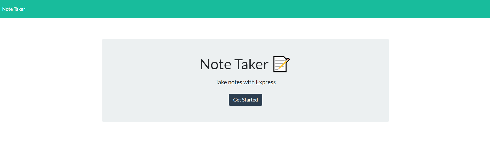
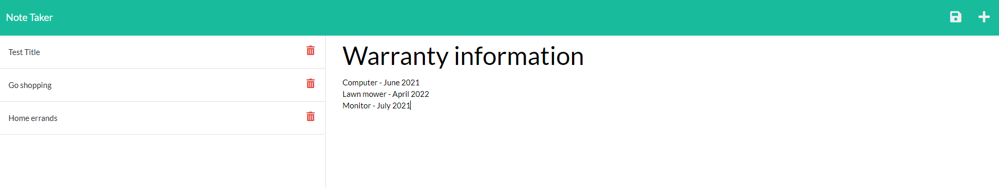

# Homework Assignment - 11 Express.js: Note Taker

## Table of Contents
[Description](#description)

[Key Features](#key-features)

[License](#license)

[Links](#links)

[Screenshots](#screenshots)

## Description
The focus of this homework assignment for the University of Toronto SCS Coding Boot Camp was to modify starter code to create an application called Note Taker that can be used to write and save notes. This application uses an Express.js back end and saves and retrieves note data from a JSON file.

## Key Features
- The application uses the Express package from [npm](https://www.npmjs.com/package/express) to manage GET, POST, and DELETE requests
- A unique ID is created for notes using the uuid package available at [npm](https://www.npmjs.com/package/uuid)
- Node.js' built in file system module is used to read and write to a file containing notes
- If user enters a HTML route on the site other than one established they'll be directed to the main landing page as a result of an HTML route using a wildcard
- User begins on the landing page and when they click on the link for the notes page they are routed to the notes page with notes listed and space to add a note
- User can see all notes in JSON format when they visit "/api/notes"
- User can add notes and delete notes and db.json file is updated

## License
This product is under the MIT License.

## Links
- [GitHub repository](https://github.com/darylnauman/note-taker)
- [Deployed application on Heroku](https://shielded-brook-40956.herokuapp.com/)

## Screenshots
The images below show the application.

